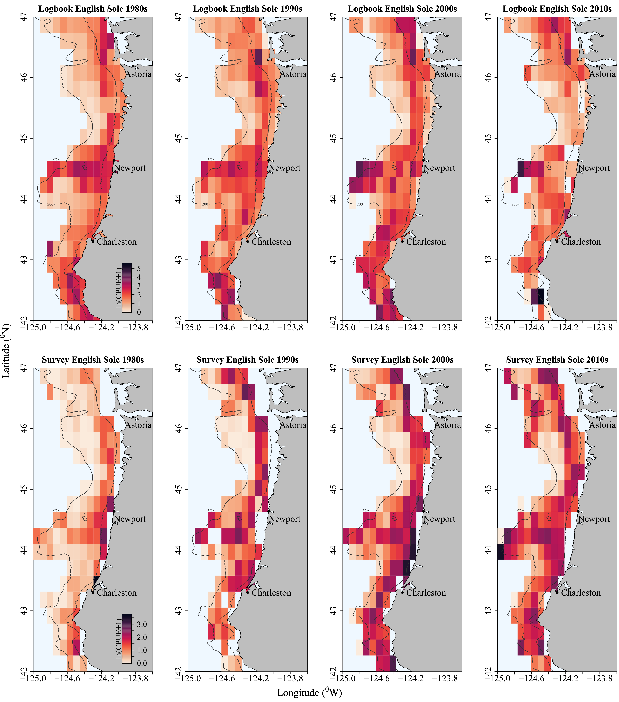

```{r setup, include=FALSE}
knitr::opts_chunk$set(echo = TRUE)
library(knitr)
library(grid)
library(tiff)
```


```{r, echo = F, fig.width = 5, fig.height = 2.5, fig.cap = "Figure S1: Gear used during each decade."}
include_graphics("../final_figs/manuscript2_fig_tables/gear_types.jpg")
```

####
####
```{r, echo = F, dpi = 300, fig.width = 5, fig.height = 2.5, fig.cap = "Figure S2: Catch of Dover sole by the Oregon commercial bottom trawl fleet."}
grid.raster(readTIFF("../final_figs/manuscript2_fig_tables/dover_sole_catch.tiff"))
```

####
####
```{r, echo = F, dpi = 300, fig.width = 5, fig.height = 2.5, fig.cap = "Figure S3: Catch of petrale sole by the Oregon commercial bottom trawl fleet."}
grid.raster(readTIFF("../final_figs/manuscript2_fig_tables/petrale_sole_catch.tiff"))
```

####
####
```{r, echo = F, dpi = 300, fig.width = 5, fig.height = 2.5, fig.cap = "Figure S4: Catch of English sole by the Oregon commercial bottom trawl fleet."}
grid.raster(readTIFF("../final_figs/manuscript2_fig_tables/english_catch.tiff"))
```

####
####
```{r, echo = F, dpi = 300, fig.width = 5, fig.height = 2.5, fig.cap = "Figure S5: Catch of Pacific sanddab by the Oregon commercial bottom trawl fleet."}
grid.raster(readTIFF("../final_figs/manuscript2_fig_tables/sanddab_catch.tiff"))
```

####
####
```{r, echo = F, dpi = 300, fig.width = 5, fig.height = 2.5, fig.cap = "Figure S6: Catch of starry flounder by the Oregon commercial bottom trawl fleet."}
grid.raster(readTIFF("../final_figs/manuscript2_fig_tables/starry_catch.tiff"))
```

####
####
```{r, echo = F, dpi = 300, fig.width = 5, fig.height = 2.5, fig.cap = "Figure S7: Catch of sand sole by the Oregon commercial bottom trawl fleet."}
grid.raster(readTIFF("../final_figs/manuscript2_fig_tables/sand_sole_catch.tiff"))
```

\newpage 
```{r, echo = F, dpi = 300, fig.width = 5, fig.height = 2.5}
grid.raster(readTIFF("../final_figs/manuscript2_fig_tables/dover_sole_change.tiff"))
```

```{r, echo = F, dpi = 300, fig.width = 5, fig.height = 2.5, fig.cap = "Figure S8: Change in CPUE of Dover sole by the Oregon commercial bottom trawl fleet (upper panel) and the NOAA surveys (lower panel)."}
grid.raster(readTIFF("../final_figs/manuscript2_fig_tables/dover_change_survey.tiff"))
```

\newpage
```{r, echo = F, dpi = 300, fig.width = 5, fig.height = 2.5}
grid.raster(readTIFF("../final_figs/manuscript2_fig_tables/petrale_sole_change.tiff"))
```

```{r, echo = F, dpi = 300, fig.width = 5, fig.height = 2.5, fig.cap = "Figure S9: Change in CPUE of petrale sole as in Figure S8."}
grid.raster(readTIFF("../final_figs/manuscript2_fig_tables/petrale_change_survey.tiff"))
```

\newpage
```{r, echo = F, dpi = 300, fig.width = 5, fig.height = 2.5}
grid.raster(readTIFF("../final_figs/manuscript2_fig_tables/english_change.tiff"))
```

```{r, echo = F, dpi = 300, fig.width = 5, fig.height = 2.5, fig.cap = "Figure S10: Change in CPUE of English sole as in Figure S8."}
grid.raster(readTIFF("../final_figs/manuscript2_fig_tables/english_change_survey.tiff"))
```

\newpage
```{r, echo = F, dpi = 300, fig.width = 5, fig.height = 2.5}
grid.raster(readTIFF("../final_figs/manuscript2_fig_tables/sanddab_change.tiff"))
```

```{r, echo = F, dpi = 300, fig.width = 5, fig.height = 2.5, fig.cap = "Figure S11: Change in CPUE of Pacific sanddab as in Figure S8."}
grid.raster(readTIFF("../final_figs/manuscript2_fig_tables/sanddab_change_survey.tiff"))
```

\newpage
```{r, echo = F, dpi = 300, fig.width = 5, fig.height = 2.5}
grid.raster(readTIFF("../final_figs/manuscript2_fig_tables/starry_change.tiff"))
```

```{r, echo = F, dpi = 300, fig.width = 5, fig.height = 2.5, fig.cap = "Figure S12: Change in CPUE of starry flounder as in Figure S8."}
grid.raster(readTIFF("../final_figs/manuscript2_fig_tables/starry_change_survey.tiff"))
```

\newpage
```{r, echo = F, dpi = 300, fig.width = 5, fig.height = 2.5}
grid.raster(readTIFF("../final_figs/manuscript2_fig_tables/sand_sole_change.tiff"))
```

```{r, echo = F, dpi = 300, fig.width = 5, fig.height = 2.5, fig.cap = "Figure S13: Change in CPUE of sand sole as in Figure S8"}
grid.raster(readTIFF("../final_figs/manuscript2_fig_tables/sandsole_change_survey.tiff"))
```

\newpage
```{r, echo = F, dpi = 300, fig.cap = "Figure S14: The spatial distribution of CPUE for Dover sole over four decades. The top four panels depict data from logbooks and the bottom four panels depict data from the NOAA surveys. Grid cells indicate average log transformed CPUE in each area."}

```

```{r, echo = F, dpi = 300, fig.cap = "Figure S15: The spatial distribution of CPUE for petrale sole as in Figure S14"}

```

```{r, echo = F, dpi = 300, fig.cap = "Figure S16: The spatial distribution of CPUE for English sole as in Figure S14"}

```

```{r, echo = F, dpi = 300, fig.cap = "Figure S17: The spatial distribution of CPUE for Pacific sanddab as in Figure S14"}

```

```{r, echo = F, dpi = 300, fig.cap = "Figure S18: The spatial distribution of CPUE for sand sole as in Figure S14"}

```

```{r, echo = F, dpi = 300, fig.cap = "Figure S19: The spatial distribution of CPUE for starry flounder as in Figure S14"}

```

```{r, echo = F, dpi = 300, fig.cap = "Figure S20: The spatial distribution of CPUE for Dover sole over four decades for the winter (upper panels) and summer months (lower panels). Grid cells indicate average log transformed CPUE in each area."}

```

```{r, echo = F, dpi = 300, fig.cap = "Figure S21: The spatial distribution of CPUE for petrale sole over four decades for the winter (upper panels) and summer months (lower panels). Grid cells indicate average log transformed CPUE in each area."}

```

```{r, echo = F, dpi = 300}
grid.raster(readTIFF("../final_figs/manuscript2_fig_tables/dover_sole_depth.tiff"))
```

```{r, echo = F, dpi = 300, fig.cap = "Figure S22: Contour maps depicting depth distribution of Dover sole for the logbooks (upper four panels) and for the survey (lower four panels)."}
grid.raster(readTIFF("../final_figs/manuscript2_fig_tables/dover_sole_depth_winter.tiff"))
```
